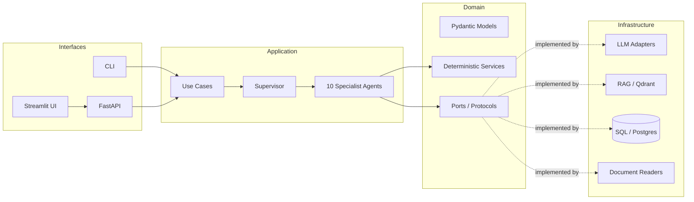
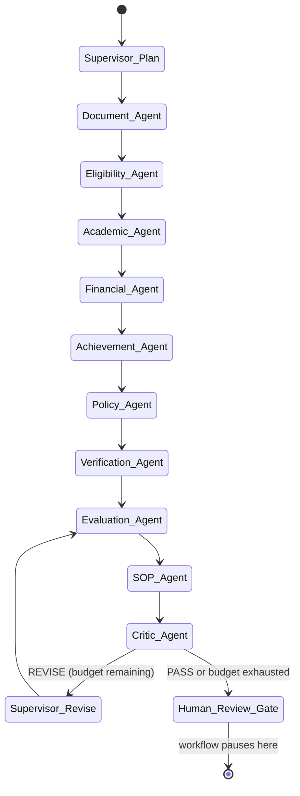

# ScholarAI Workforce

Repository: [github.com/rahatRiSD/scholarai-workforce](https://github.com/rahatRiSD/scholarai-workforce)

A Supervisor-orchestrated, multi-agent AI system for **explainable, human-in-the-loop
university scholarship evaluation** — built with LangGraph, FastAPI, and Streamlit.

> Every number this system produces is either a deterministic calculation you can
> re-run by hand, or a claim backed by a citable piece of `Evidence`. Nothing is ever
> approved, rejected, or finalized without a human reviewer. See
> [Architecture](docs/ARCHITECTURE.md) and [Human-in-the-Loop](docs/HUMAN_IN_LOOP.md).

## 1. Overview

Northfield University (a fictional institution used throughout this project's sample
data) receives hundreds of scholarship applications per cycle. Each one arrives as a
loose bundle of documents — transcripts, financial statements, achievement records,
application forms — and has to be checked against eligibility rules, scored on academic
merit / financial need / achievements, cross-checked for inconsistencies, weighed
against scholarship policy, and ultimately recommended to a human reviewer with a full
paper trail of *why*.

ScholarAI Workforce automates the labor-intensive parts of that process — document
parsing, rule-checking, deterministic scoring, policy lookup, cross-document
verification — while keeping every subjective or high-stakes step (does this
recommendation actually hold up? should this applicant be approved?) in the hands of a
human. It is a **workforce of specialist AI agents supervised by a planner**, not a
chatbot: you submit an application, the Supervisor plans and runs the right specialists
for that scholarship, a Critic agent independently audits the result, and a human
reviewer makes the final call.

## 2. Problem statement

Manual scholarship review is slow, inconsistent across reviewers, and hard to audit:
two reviewers can reach different conclusions from the same file, and it's rarely clear
after the fact exactly *which* piece of evidence drove a decision. ScholarAI Workforce
addresses this by making every step of the evaluation:

- **Deterministic where it can be.** GPA normalization, eligibility checks, financial
  need scoring, achievement scoring, and the overall weighted score are all plain
  Python — the same inputs always produce the same outputs. LLMs are only used to
  *narrate* those numbers in plain language (see [ARCHITECTURE.md](docs/ARCHITECTURE.md)).
- **Explainable.** Every finding a specialist agent makes carries an `Evidence` record:
  its source, a quote or computation, and a quality label (`direct`, `inferred`, or
  `unavailable`). An agent that can't find support for a claim says so — it never
  fabricates a citation.
- **Self-checking.** A Critic agent independently recomputes the overall score and
  checks the recommendation against six criteria before anything reaches a human,
  catching internal inconsistencies automatically (bounded to 2 revision cycles by
  default, so it can't loop forever).
- **Human-in-the-loop by construction.** The workflow always pauses before a final
  decision. There is no code path that reaches an `approved`/`rejected` status without
  a human explicitly recording that decision.

## 3. Key features

- **Supervisor + 10 specialist agents**: Document Analysis, Eligibility, Academic
  Evaluation, Financial Need, Achievement, Policy/RAG, Verification, Evaluation,
  SOP Writer, and Critic.
- **Dynamic planning**: the Supervisor builds a plan per scholarship (skipping agents a
  scholarship gives zero weight to) and re-plans on the fly once real extracted data is
  available.
- **Agent-to-agent communication**: a typed `AgentMessage` channel, independent of the
  shared state, so handoffs are inspectable rather than implicit.
- **RAG over a real policy knowledge base**: Markdown-aware chunking, deterministic
  hashing embeddings (or OpenAI embeddings when configured), Qdrant vector search, and
  section-level citations.
- **Five tool integrations**: document parsing, RAG retrieval, privacy-safe public web
  search (DuckDuckGo by default; Tavily optional), Python calculation utilities, and
  database/episode lookups.
- **Shared long-term memory**: every completed evaluation is persisted as an episode
  (SQL) and semantically indexed (vector store) so future evaluations can recall
  similar prior cases.
- **Critic-driven revision loop**: bounded, targeted re-runs of only the agents implicated
  by the Critic's specific issues — not a blind full restart.
- **Human-in-the-loop gate**: APPROVE / REJECT / REQUEST REVIEW / REQUEST MORE
  INFORMATION, with the workflow re-runnable on request.
- **Full observability**: structured, privacy-redacting logs; a typed execution trace;
  graceful per-agent error handling that never crashes the whole run.
- **Operator-grade Streamlit UI**: one-second live polling, pause/resume/cancel/retry,
  actual LangGraph topology, communication history, provider token/cost usage,
  downloadable logs, evidence/SOP viewers, memory browser, and knowledge-base admin.
- **Offline-by-default**: runs with zero API keys via a deterministic offline LLM
  client and hashing-based embeddings — genuinely runnable end-to-end on a laptop with
  no network access.

## 4. Architecture

See [docs/ARCHITECTURE.md](docs/ARCHITECTURE.md) for the full write-up (hexagonal
layering, deterministic-vs-LLM boundary, design rationale for the human-in-the-loop
gate). Short version:





## 5. Agents

| Agent | Responsibility |
|---|---|
| **Supervisor** | Builds the plan, routes execution, decides revision targets on REVISE |
| **Document Analysis** | Deterministic regex extraction + optional LLM refinement of student/academic/financial data |
| **Eligibility** | Checks CGPA/credits/semester/documents against scholarship requirements |
| **Academic Evaluation** | Normalizes CGPA, detects trend, assesses consistency |
| **Financial Need** | Scores financial need; explicitly flags "UNKNOWN / NEEDS HUMAN REVIEW" rather than guessing |
| **Achievement** | Scores extracurriculars/awards/publications by category |
| **Policy / RAG** | Answers policy questions from the indexed knowledge base, with citations |
| **Verification** | Cross-checks documents for conflicting facts (e.g. two different CGPAs) |
| **Evaluation** | Deterministically combines all component scores into an overall recommendation |
| **SOP Writer** | Drafts a fact-grounded student statement of purpose from verified application evidence |
| **Critic** | Independently re-derives the score and audits it against 6 criteria |

Full detail in [docs/AGENTS.md](docs/AGENTS.md).

## 6. LangGraph workflow

The Supervisor is compiled as a LangGraph `StateGraph`: a mutable `plan` + `current_step`
drive conditional routing between specialist nodes, `evaluation_agent` combines their
outputs, `sop_agent` prepares the student draft, `critic_agent` audits the result, and
the graph either loops back to a `supervisor_revise`
node (bounded by `max_critic_revisions`) or reaches `human_review_gate`, where the graph
**intentionally stops** — see [docs/HUMAN_IN_LOOP.md](docs/HUMAN_IN_LOOP.md) for why this
uses a plain terminal node rather than LangGraph's `interrupt()`/checkpointer machinery.

## 7. Tech stack

Python 3.12 · LangGraph · Pydantic v2 / Pydantic Settings · SQLAlchemy 2.0 (async) ·
PostgreSQL / SQLite · Qdrant · FastAPI · Streamlit · OpenAI / Groq / Anthropic / Ollama (pluggable) ·
structlog · PyMuPDF · python-docx · pytest.

## 8. Installation

Requires Python 3.12+ and [`uv`](https://docs.astral.sh/uv/) (recommended) or `pip`.

```bash
git clone <this-repo>
cd scholarai-workforce
uv sync --all-extras --dev        # or: pip install -e ".[websearch]"
cp .env.example .env              # defaults work with zero edits
```

## 9. Environment variables

See [`.env.example`](.env.example) for the full annotated list. Nothing is required to
run the demo — no key means the LLM layer falls back to a deterministic offline mode
(`SCHOLARAI_LLM__PROVIDER=offline` is automatic, not something you need to set).

## 10. Docker setup

```bash
docker compose up --build
```

Starts PostgreSQL, Qdrant, the FastAPI backend (`localhost:8000`), and the Streamlit UI
(`localhost:8501`). Set `SCHOLARAI_LLM__OPENAI_API_KEY`, `..._GROQ_API_KEY`, or
`..._ANTHROPIC_API_KEY` in
your shell before `up` to use a real LLM provider instead of offline mode.

## 11. Local setup (no Docker)

```bash
uv run scholarai status          # verify configuration + wiring
uv run scholarai demo            # run the full 5-student demo end to end
```

## 12. Running the API

```bash
uv run scholarai serve           # http://localhost:8000, docs at /docs
# or directly:
uv run uvicorn scholarai.interfaces.api.app:app --reload
```

## 13. Running Streamlit

```bash
uv run streamlit run ui/streamlit_app/app.py
```

Point it at a running backend via the sidebar "Backend connection" panel, or set
`SCHOLARAI_API_BASE_URL` / `SCHOLARAI_API_KEY` in your environment first.

## 14. Loading the knowledge base

The policy knowledge base (`data/knowledge_base/*.md`) is ingested automatically on
startup (`bootstrap()` in `composition.py`). To add more policy documents at runtime,
use the Streamlit **Knowledge Base** page, or:

```bash
uv run scholarai knowledge search "minimum CGPA for the merit scholarship"
```

## 15. Running a sample evaluation

```bash
uv run scholarai submit -s merit_scholarship -f data/sample_applications/student_a_strong_academic/transcript.txt
uv run scholarai evaluate --application <APP-ID-from-above>
uv run scholarai decide --application <APP-ID-from-above> -a approve
```

Or just run all five synthetic cases end to end: `uv run scholarai demo` (see
[docs/DEMO.md](docs/DEMO.md) for what each case demonstrates).

## 16. Human-in-the-loop process

Every application stops at `human_review_gate` after the Critic passes it (or exhausts
its revision budget). A reviewer — via the API, CLI, or Streamlit **Human Review**
page — records one of `approve` / `reject` / `request_review` / `request_more_information`.
Only that action finalizes the application and writes it to long-term memory. Full detail:
[docs/HUMAN_IN_LOOP.md](docs/HUMAN_IN_LOOP.md).

## 17. Memory

Two layers, see [docs/MEMORY.md](docs/MEMORY.md): a structured SQL episode history per
student, and a semantic (vector) index over past evaluations so agents/reviewers can
ask "have we seen a case like this before?"

## 18. Testing

```bash
uv run pytest                                   # unit + integration + e2e
uv run pytest tests/unit                        # pure domain logic, no I/O
uv run pytest tests/e2e/test_demo_scenarios.py   # the 5 sample students through the real graph
uv run ruff check src ui tests
uv run mypy src
```

110 tests cover deterministic scoring, RAG/web-search behavior, the full LangGraph
orchestration, background execution and controls, retry and review reruns, provider
usage capture, Streamlit control logic, and all five synthetic scenarios end to end.

## 19. Project structure

```
src/scholarai/
  domain/           pure models + deterministic services + ports (no I/O)
  application/       agents, LangGraph orchestration, tools, use cases
  infrastructure/    concrete adapters: LLM providers, RAG, DB, documents, logging
  interfaces/        FastAPI app + routes, CLI
  composition.py      the one place concrete adapters are wired together
ui/streamlit_app/     Streamlit operations console + HTTP client
data/
  knowledge_base/      synthetic Northfield University policy documents
  sample_applications/ 5 synthetic student cases for the demo/tests
tests/
  unit/ integration/ e2e/
docs/                  architecture, API, deployment, evidence templates, diagram, and presentation
```

Full API surface documented in [docs/API.md](docs/API.md).

## 20. Troubleshooting

- **"Backend unreachable" in Streamlit** — make sure `scholarai serve` (or the Docker
  `backend` service) is running and `SCHOLARAI_API_BASE_URL` matches its address.
- **401 from the API** — you've set `SCHOLARAI_API__API_KEYS`; pass a matching
  `Authorization: Bearer <key>` header (the Streamlit sidebar has an API key field).
- **`environment=production` refuses to start** — set at least one
  `SCHOLARAI_API__API_KEYS` entry; production mode intentionally won't boot
  unauthenticated.
- **RAG returns nothing** — check that `data/knowledge_base/*.md` exists and that
  bootstrap ran (it runs automatically on API/CLI startup); the Policy agent correctly
  reports `unavailable` evidence rather than guessing when retrieval is empty.
- **SQLite "database is locked"** — under concurrent load, switch to PostgreSQL via
  `SCHOLARAI_DATABASE__URL` (Docker Compose does this by default).

## 21. Security considerations

- API key auth is opt-in for local development but **mandatory in production**
  (`Settings` refuses to boot otherwise) — see `interfaces/api/security.py`.
- Bearer tokens are compared with `hmac.compare_digest` to avoid timing attacks.
- Structured logs redact sensitive fields (raw document text, full names, income
  figures, quotes) via a dedicated `structlog` processor — see
  `infrastructure/observability/logging.py`.
- No secrets are committed; `.env` is git-ignored, `.env.example` documents every
  variable with no real values.
- Uploads are size- and extension-limited (`SCHOLARAI_MAX_UPLOAD_SIZE_MB`,
  `SCHOLARAI_ALLOWED_UPLOAD_EXTENSIONS`).

## 22. Submission assets

- [Architecture diagram](docs/assets/scholarai-workforce-architecture.png)
- [Presentation deck](docs/presentation/ScholarAI_Workforce_Presentation.pptx)
- [Online deployment procedure](docs/DEPLOYMENT.md)
- [Project approval evidence record](docs/PROJECT_APPROVAL.md)
- [Weekly progress record](docs/WEEKLY_PROGRESS.md)
- [Final submission checklist](docs/SUBMISSION_CHECKLIST.md)

## 23. Production scaling note

The current background runner is intentionally in-process and the supplied deployment
runs one API worker. This provides real asynchronous execution and operator controls
for the course demonstration. A horizontally scaled production deployment should move
run coordination to a durable queue and shared control store (for example Celery/RQ
plus Redis) before adding multiple API replicas.

---

*ScholarAI Workforce is a portfolio/demonstration project. Northfield University, its
policies, and all sample student data are entirely fictional.*
